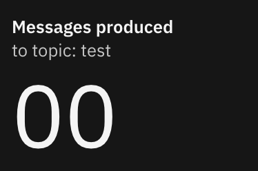

# Counter

This group acts as a Counter for a particular value with a title, subtitle and
the counter value itself.
- Counter values less than 10 are padded with an additional
`0`, e.g. a counter value of `5` is displayed as `05`.
- Counter values must be non-negative to be displayed. A negative counter value
is displayed as `00`.
- The `countLimit` property provides an upper limit to the displayed counter
value. Counter values greater than the `countLimit` property (which defaults to
`9999`) are displayed as `{countLimit}+`.


## Properties

Assuming use of the `Counter` component directly, the named properties which are
expected are as follows:

- `className` - optional - add any specific styling classes to this component.
This will be appended after the class which sets the type style, allowing
modification of the styling if needed.
- `title` - required - the title text
- `subtitle` - required - the subtitle text
- `count` - required - the Counter value as a non-negative integer.
Negative integers will be displayed as `00`.
- `countLimit` - optional - the maximum `count` value that will be displayed
as an integer. Defaults to `9999`. A `count` value that exceeds `countLimit`
will be displayed as `{countLimit}+`.

Any property which is not matched will be passed onto the parent element
rendered as a part of this component.

## Example usage

Example usage of the `Counter` component, passing a `title`, `subtitle` and `count`
property, plus a custom `className` property.

```
<Counter title={'Messages produced'} subtitle={'to topic: Test'} count={0} className={'myclass'}/>
```

Dependent on global styling, will be rendered as:


